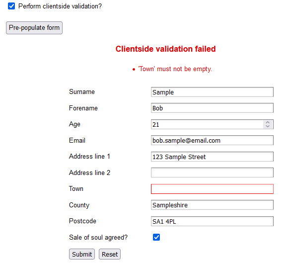

# FluentValidationLister
## WebAPI Sample

This sample has **Task Runner** jobs that are defined in `gulp.js` - this will build the scripts when the project is built.

Ruuning the sample will show two pages; one to view the payload that is returned from the server and the other to try out a simple implementation of a web form using the validation metadata.

Client-side validation can be toggled on or off during testing.

