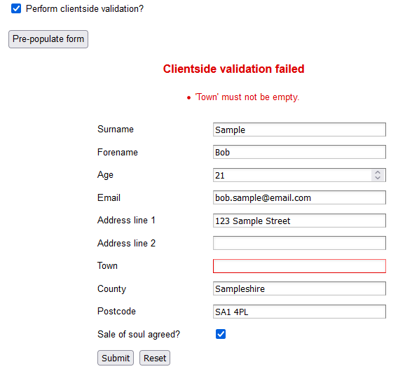

[](https://github.com/Scandal-UK/FluentValidationLister/actions?query=workflow%3A%22CI-CD%20Pipeline%22)
[](https://www.nuget.org/packages/FluentValidationLister.Filter)
[](https://www.nuget.org/packages/FluentValidationLister.Filter)
# FluentValidationLister  v1.6.1

An ASP.NET Core extension for [FluentValidation](https://github.com/JeremySkinner/FluentValidation) to provide additional endpoints that describe validator metadata for a Web API project.

> Execute your server-side FluentValidation rules automatically in the front-end!

This package adds an ActionFilter which will describe the rules and messages defined for any validator. It has been developed using [FluentValidation](https://github.com/JeremySkinner/FluentValidation).

It also describes the expected JSON datatype for every field - regardless of whether it has any validation rule applied.  This can be very helpful for automatic generation of dynamic forms.

There are generic strict TypeScript handlers for most scenarios included in the sample application. Feel free to copy and modify as required.

## Table of Contents

- [Purpose](#purpose)
- [Installation](#installation)
- [How to use](#how-to-use)
  - [Rules](#how-to-use---rules)
  - [AJAX validation](#how-to-use---ajax-validation)
  - [Advanced customisation](#how-to-use---advanced-customisation)
- [WebAPI/TypeScript Sample (net9.0)](#web-api-sample)

## Purpose

If you want to use clientside validation with the FluentValidation library (you really should), then the recommended way is to use the [FluentValidation.AspNetCore](https://www.nuget.org/packages/FluentValidation.AspNetCore/) package with ASP.NET Core MVC. It integrates perfectly and there's no need for this filter at all (note that the same is true for Razor implementations).

However, _sometimes_ you may not be using MVC - you might be using an SPA application, such as React or Angular, or maybe a mobile application front-end. In this case you should probably want your clientside validators to match your server-side FluentValidation validators, without having to duplicate the effort - this filter exposes the validators on the clientside.

You still need to implement this in your front-end validation - this just provides a nice way to access the validator information for any endpoint, exposing and formatting the metadata provided by the FluentValidation library.

In addition to the validator metadata, the expected JSON datatypes are also described for every field - even if they do not have any FluentValidation rules applied. This could allow you to ensure the correct datatype is submitted, or more likely, to ensure the correct input is displayed to the end-user.

> In the Web API sample project, I have provided a working TypeScript demonstration using jQuery. It is very basic and will require some extension for your own use, but it demonstrates strict-typing of the returned response and a commented sample of expected usage.

## Installation

1. Install the [NuGet package](https://www.nuget.org/packages/FluentValidationLister.Filter/)

2. In the _ConfigureServices_ method of _Startup.cs_, include a call to `AddFluentValidationFilter` instead of `AddFluentValidation`.

```csharp
public void ConfigureServices(IServiceCollection services)
{
    ...

    services.AddFluentValidationFilter();
}
```

3. In order for ASP.NET to discover your validators, they must be registered with the services collection. You must do this by calling the `AddTransient` method for each of your validators. Adding all validators in a specified assembly is not supported.

```csharp
    services.AddFluentValidationFilter();

    services.AddTransient<IValidator<Person>, PersonValidator>();
    // (repeat for every validator)
```

## How to use

For any given endpoint, add the query-string `?validation=1` to the endpoint URL in order to view the validator details, if applicable.

> **XML is only supported in versions prior to v1.2** but the documentation/examples will be using JSON. XML support was deprecated because none of the consumers of this package seemed to be using XML anyway(!)

Along with the ``validatorList`` you are also presented with an ``errorList`` of potential messages and a ``typeList`` that describes the JSON type for each form element. If the model has no validator, only the ``typeList`` will be populated with values.

Example output for JSON:

```json
{
  "validatorList": {
    "foreName": {
      "required": true,
      "length": {
        "min": 2,
        "max": 10
      }
    },
    "age": {
      "required": true,
      "range": {
        "from": 16,
        "to": 60
      }
    },
    "address.line1": {
      "required": true
    }
  },
  "errorList": {
    "foreName": {
      "required": "'Forename' must not be empty.",
      "length": "'Forename' must be between 2 and 10 characters."
    },
    "age": {
      "required": "'Age' must not be empty.",
      "range": "'Age' must be between 16 and 60."
    },
    "address.line1": {
      "required": "'Line1' must not be empty."
    }
  },
  "typeList": {
    "foreName": "string",
    "age": "number",
    "address.line1": "string",
    "address.line2": "string"
  }
}
```

> **Note:** You will need to put something in the body for POST/PUT requests, but if you add the `validation=1` query-string parameter then the posted body will be ignored - in the demo we simply post `{}`.

### How to use - Rules

The following validator rules are presented to the client:

- NotNull/NotEmpty (required)
- Matches (regex)
- InclusiveBetween (range)
- ExclusiveBetween (exclusiveRange)
- Email
- EqualTo (cross-property equality comparison)
- MaxLength
- MinLength
- Length (including exactLength)

The following validators are presented as "remote" to the client (they can be validated using AJAX, see below):

- CreditCard
  - https://github.com/dotnet/corefx/blob/master/src/System.ComponentModel.Annotations/src/System/ComponentModel/DataAnnotations/CreditCardAttribute.cs
  - https://github.com/JeremySkinner/FluentValidation/blob/master/src/FluentValidation/Validators/CreditCardValidator.cs
- Phone
  - https://github.com/dotnet/corefx/blob/master/src/System.ComponentModel.Annotations/src/System/ComponentModel/DataAnnotations/PhoneAttribute.cs
- ScalePrecision (e.g. .Numeric(scale, precision); )
- NotEqual
- Enum

### How to use - AJAX validation

For unsupported validators or validators with custom server-side logic, the rule will be presented as "remote" - the field can be validated using an AJAX call to the back-end.

You can validate any particular field by adding the query string _validate=fieldName_ and if the field is not valid, a problem details will be returned including errors only relevant to the specified field.

### How to use - Advanced customisation

You should find all customisation requirements are encapsulated in the `ValidationLister` class.

If you want to customise this package (such as the returned names for rules), I would advise that you copy/alter this class. Doing so will invalidate the unit tests but you can maintain those in your own fork.

Should you find a more "standard" way of presenting the validation information then please contribute to the project!

## Web API Sample

The included dotnet Web API Sample application is designed to be a minimal demonstration of how this package works (the same code will work with earlier versions of dotnet core).

> There is no Razor/MVC example because this package is unnecessary for those projects. This package is for other front-ends that need access to the validation metadata.

Aside from the default Visual Studio template; it includes one controller, two models and two validators. The startup class includes the minimum setup detailed above. Unnecessary libraries (including Entity Framework Core) have been removed for minimal dependencies.

The first screen runs a very basic (and fully-commented) snippet of TypeScript to return and display the validation metadata for an endpoint.

The second screen shows a generic TypeScript implementation with a web form, this time using the jQuery library. It displays client-side and server-side (problem details) validation errors in the same way for comparison. **Note that this script is generic, so there is an expectation that the form field names match the JSON property names for this to work properly!**

The validators in the project demonstrate these features of the filter;

- Required JSON datatypes are exposed from the backend _(e.g. age and saleOfSoulAgreed)_
- Child records are returned with a dot delimiter _(e.g. Address.Line1)_
- `.WithName()` is respected in the returned messages _(e.g. Address.Line1)_
- JSON datatypes are listed **even if they have no related validator** _(e.g. Address.Line2)_
- Custom regular expressions are returned _(e.g. Address.Postcode)_
- Custom error messages are returned where defined _(e.g. Address.County)_

---


