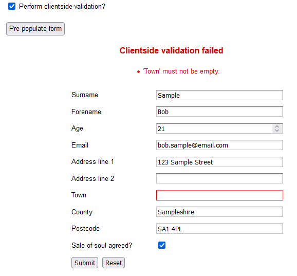

[](https://github.com/Scandal-UK/FluentValidationLister/actions?query=workflow%3A%22CI-CD%20Pipeline%22)
[](https://www.nuget.org/packages/FluentValidationLister.Filter)
[](https://www.nuget.org/packages/FluentValidationLister.Filter)

# FluentValidationLister

Expose FluentValidation rules from an ASP.NET Core API so that client applications can use the same validation rules as the server.

FluentValidation is an excellent place to define application validation, but with a separate SPA, mobile application or other API client there is a familiar problem: the client needs many of the same rules.

Maintaining those rules twice is both repetitive and error-prone.

FluentValidationLister exposes the metadata from your existing FluentValidation validators through the API. A client can use that metadata to construct its own validation behaviour while the server remains the authoritative source of the rules.



## What it provides

For an API model with a registered FluentValidation validator, FluentValidationLister can expose:

- validation rules and their parameters
- validation messages, including custom messages
- JSON data types
- regular expressions
- nested property names
- overridden display names
- metadata for properties that have no validation rules

The package also supports validation of an individual property through the API, allowing client applications to defer rules that cannot reasonably be reproduced locally.

## Installation

Install the NuGet package:

```bash
dotnet add package FluentValidationLister
```

Register the filter and your validators:

```csharp
public void ConfigureServices(IServiceCollection services)
{
    services.AddFluentValidationFilter();

    services.AddTransient<IValidator<Person>, PersonValidator>();
}
```

Validators must be registered with the service collection so that FluentValidationLister can discover them.

## Listing validation rules

Append `?validation=1` to an API endpoint:

```text
GET /api/person?validation=1
```

For POST or PUT endpoints, send an empty object as the request body where required.

Instead of executing the normal action, FluentValidationLister returns a description of the validator associated with that endpoint.

The response contains the information a client needs to build appropriate validation behaviour from the server-side rules.

## Validating a single property

Some validation is inherently server-side. A uniqueness check, for example, may require access to a database and cannot sensibly be reproduced in JavaScript.

A client can request validation for an individual field:

```text
POST /api/person?validate=email
```

This allows local rules to be handled immediately in the client while rules requiring server-side state can still use the same FluentValidation validator.

## Why use it?

The aim is not to move validation out of the API.

Server-side validation remains authoritative and should always be performed. FluentValidationLister provides a way for another client to understand enough about those rules to give users immediate feedback without maintaining a second, independent validation model.

That is particularly useful where an ASP.NET Core API is consumed by:

- a TypeScript/JavaScript SPA
- React, Angular, Vue or another front-end framework
- a mobile application
- another client that can interpret the returned metadata

The client is free to decide how that metadata should be presented or applied.

## Sample application

`FluentValidationLister.WebApiSample` demonstrates the complete round trip rather than just the API response.

It includes an ASP.NET Core API and a browser client written in TypeScript. One page displays the validation metadata returned by the server; another uses that metadata to populate client-side validation dynamically.

The sample covers behaviour including nested models, JSON types, custom regular expressions, overridden property names and custom validation messages.

It is deliberately kept separate from the library itself: FluentValidationLister provides the metadata, while the client decides what to do with it.

## Licence

Licensed under the Apache License 2.0.
